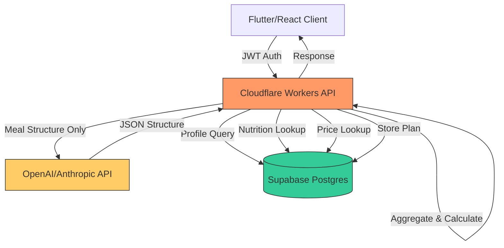

# Gurmaio Technical Architecture

## System Overview

Gurmaio is a cloud-native, edge-first meal planning platform with strict separation between:
- **Thin Client** (Flutter/React): UI, authentication, display only
- **Stateless API** (Cloudflare Workers): Orchestration, deterministic calculations
- **Persistent Store** (Supabase): User data, ingredient library, generated plans
- **AI Service**: Meal composition generation (structure only, no calculations)

---

## Architecture Principles

1. **Edge-First**: API runs on Cloudflare Workers (280+ locations globally)
2. **Stateless**: No server-side sessions, JWT-based authentication
3. **Deterministic Calculations**: All nutrition and cost calculations in backend
4. **Separation of Concerns**: AI generates structure, engines calculate values
5. **Budget-First**: Cost calculation and enforcement at every level
6. **Audit Trail**: All calculations traceable and reproducible

---

## Cloud Architecture



**Flow**:
1. Client sends authenticated request to Cloudflare Workers
2. Workers validate JWT, fetch user profile from Supabase
3. Workers call AI with constraints (budget, preferences, days)
4. AI returns structured meal composition (NO calculations)
5. Workers run deterministic engines:
   - Nutrition Engine: Lookup + aggregate nutrition per ingredient/meal/day
   - Cost Engine: Calculate costs per ingredient/meal/day with shopping reality
   - Budget Validator: Compare total cost vs user budget
6. If over budget: Retry AI generation with adjusted constraints (max 3 attempts)
7. Store validated plan in Supabase
8. Return complete plan with all breakdowns to client

---

## Folder Structure

```
gurmaio-workers/
├── src/
│   ├── api/
│   │   ├── routes/
│   │   │   ├── profile.ts          # POST /profile
│   │   │   ├── meal-plans.ts       # POST /meal-plans/generate, GET /current
│   │   │   ├── shopping-list.ts    # GET /shopping-list
│   │   │   └── account.ts          # DELETE /account
│   │   └── middleware/
│   │       ├── auth.ts             # JWT validation
│   │       └── cors.ts             # CORS headers
│   ├── engines/
│   │   ├── nutrition.ts            # Nutrition aggregation engine
│   │   ├── cost.ts                 # Cost calculation engine
│   │   └── shopping-list.ts        # Shopping list aggregation
│   ├── services/
│   │   ├── ai.ts                   # AI meal generation client
│   │   └── supabase.ts             # Supabase client wrapper
│   ├── types/
│   │   ├── api.ts                  # API request/response types
│   │   ├── domain.ts               # Domain models
│   │   └── database.ts             # Supabase schema types
│   ├── utils/
│   │   ├── validation.ts           # Input validation
│   │   └── units.ts                # Unit conversion utilities
│   └── index.ts                    # Worker entry point
├── migrations/
│   └── supabase/
│       ├── 001_initial_schema.sql
│       ├── 002_ingredient_nutrition.sql
│       └── 003_meal_plans.sql
└── wrangler.toml                   # Cloudflare Workers config
```

---

## API Contracts

### Authentication
All endpoints require JWT bearer token:
```
Authorization: Bearer <supabase-jwt-token>
```

---

### POST /profile

**Purpose**: Save user onboarding data

**Request**:
```typescript
{
  budget_eur: number;           // Daily or period budget in EUR
  budget_period: "daily" | "weekly";
  meal_plan_days: number;       // 3, 5, 7, or custom
  dietary_preferences: string[]; // ["vegetarian", "high-protein"]
  allergens: string[];          // ["nuts", "dairy", "gluten"]
  cuisine_preferences: string[]; // ["italian", "asian", "mediterranean"]
  target_calories?: number;     // Optional daily calorie target
}
```

**Response** (200):
```typescript
{
  profile_id: string;
  saved_at: string; // ISO timestamp
}
```

**Errors**:
- 400: Invalid budget or preferences
- 401: Invalid JWT

---

### POST /meal-plans/generate

**Purpose**: Generate a complete meal plan with all calculations

**Request**:
```typescript
{
  regenerate?: boolean; // Force new generation even if current exists
}
```

**Response** (200):
```typescript
{
  plan_id: string;
  generated_at: string;
  user_id: string;
  
  metadata: {
    period_budget_eur: number;
    period_cost_eur: number;
    budget_remaining_eur: number;
    is_over_budget: boolean;
    generation_attempts: number; // How many AI retries
    days: number;
  };
  
  days: Array<{
    day_number: number;
    date: string; // ISO date
    
    totals: {
      calories: number;
      protein_g: number;
      carbohydrates_g: number;
      fats_g: number;
      cost_eur: number;
    };
    
    meals: Array<{
      meal_id: string;
      meal_type: "breakfast" | "lunch" | "dinner" | "snack";
      recipe_name: string;
      
      nutrition: {
        calories: number;
        protein_g: number;
        carbohydrates_g: number;
        fats_g: number;
      };
      
      cost: {
        meal_cost_eur: number;
      };
      
      ingredients: Array<{
        ingredient_id: string;
        name: string;
        quantity_g: number;
        nutrition: {
          calories: number;
          protein_g: number;
          carbohydrates_g: number;
          fats_g: number;
        };
        cost_eur: number;
      }>;
    }>;
  }>;
  
  plan_totals: {
    total_calories: number;
    total_protein_g: number;
    total_carbohydrates_g: number;
    total_fats_g: number;
    total_cost_eur: number;
  };
}
```

**Errors**:
- 400: Invalid user profile (must complete onboarding first)
- 402: Budget too low for minimum viable plan
- 500: AI generation failed after max retries
- 503: AI service unavailable

---

### GET /meal-plans/current

**Purpose**: Retrieve the currently active meal plan

**Response** (200):
Same structure as POST /meal-plans/generate

**Errors**:
- 404: No active meal plan (must generate one first)

---

### GET /shopping-list

**Purpose**: Generate aggregated shopping list from current meal plan

**Response** (200):
```typescript
{
  plan_id: string;
  generated_at: string;
  
  items: Array<{
    ingredient_id: string;
    display_name: string;
    total_quantity: number;
    unit: "g" | "ml" | "pieces";
    minimum_purchase_quantity: number; // Real-world shopping constraint
    estimated_price_eur: number;
  }>;
  
  summary: {
    total_items: number;
    total_shopping_cost_eur: number; // Realistic grocery basket total
    plan_cost_eur: number;           // Actual meal plan cost
    waste_cost_eur: number;          // Difference (unused portions)
  };
}
```

**Errors**:
- 404: No active meal plan

---

### DELETE /account

**Purpose**: Delete all user data (GDPR compliance)

**Response** (204):
No content

**Errors**:
- 401: Invalid JWT

---

## Data Models (Supabase)

### users
```sql
CREATE TABLE users (
  id UUID PRIMARY KEY DEFAULT uuid_generate_v4(),
  email TEXT UNIQUE NOT NULL,
  created_at TIMESTAMPTZ DEFAULT NOW(),
  last_login TIMESTAMPTZ
);
```

### user_profiles
```sql
CREATE TABLE user_profiles (
  id UUID PRIMARY KEY DEFAULT uuid_generate_v4(),
  user_id UUID REFERENCES users(id) ON DELETE CASCADE,
  budget_eur DECIMAL(10, 2) NOT NULL,
  budget_period TEXT NOT NULL CHECK (budget_period IN ('daily', 'weekly')),
  meal_plan_days INTEGER NOT NULL,
  dietary_preferences TEXT[] DEFAULT '{}',
  allergens TEXT[] DEFAULT '{}',
  cuisine_preferences TEXT[] DEFAULT '{}',
  target_calories INTEGER,
  created_at TIMESTAMPTZ DEFAULT NOW(),
  updated_at TIMESTAMPTZ DEFAULT NOW(),
  UNIQUE(user_id)
);
```

### ingredient_nutrition
```sql
CREATE TABLE ingredient_nutrition (
  id UUID PRIMARY KEY DEFAULT uuid_generate_v4(),
  ingredient_name TEXT UNIQUE NOT NULL,
  category TEXT NOT NULL, -- "protein", "vegetable", "grain", "dairy", etc.
  
  -- Nutrition per 100g
  calories_per_100g DECIMAL(8, 2) NOT NULL,
  protein_per_100g DECIMAL(6, 2) NOT NULL,
  carbohydrates_per_100g DECIMAL(6, 2) NOT NULL,
  fats_per_100g DECIMAL(6, 2) NOT NULL,
  
  -- Allergen flags
  contains_gluten BOOLEAN DEFAULT FALSE,
  contains_dairy BOOLEAN DEFAULT FALSE,
  contains_nuts BOOLEAN DEFAULT FALSE,
  contains_shellfish BOOLEAN DEFAULT FALSE,
  
  created_at TIMESTAMPTZ DEFAULT NOW(),
  updated_at TIMESTAMPTZ DEFAULT NOW()
);

CREATE INDEX idx_ingredient_category ON ingredient_nutrition(category);
CREATE INDEX idx_ingredient_name ON ingredient_nutrition(ingredient_name);
```

### grocery_price_estimates
```sql
CREATE TABLE grocery_price_estimates (
  id UUID PRIMARY KEY DEFAULT uuid_generate_v4(),
  ingredient_id UUID REFERENCES ingredient_nutrition(id),
  region TEXT NOT NULL DEFAULT 'EU', -- "EU", "US", "UK", etc.
  
  price_per_100g_eur DECIMAL(8, 2) NOT NULL,
  minimum_purchase_quantity_g INTEGER NOT NULL, -- e.g., 250g for butter
  typical_package_size_g INTEGER, -- e.g., 1000g for flour
  
  currency_code TEXT DEFAULT 'EUR',
  last_updated TIMESTAMPTZ DEFAULT NOW(),
  
  UNIQUE(ingredient_id, region)
);

CREATE INDEX idx_price_ingredient ON grocery_price_estimates(ingredient_id);
CREATE INDEX idx_price_region ON grocery_price_estimates(region);
```

### meal_plans
```sql
CREATE TABLE meal_plans (
  id UUID PRIMARY KEY DEFAULT uuid_generate_v4(),
  user_id UUID REFERENCES users(id) ON DELETE CASCADE,
  
  generated_at TIMESTAMPTZ DEFAULT NOW(),
  is_active BOOLEAN DEFAULT TRUE,
  
  -- Budget metadata
  period_budget_eur DECIMAL(10, 2) NOT NULL,
  period_cost_eur DECIMAL(10, 2) NOT NULL,
  budget_remaining_eur DECIMAL(10, 2) NOT NULL,
  is_over_budget BOOLEAN DEFAULT FALSE,
  generation_attempts INTEGER DEFAULT 1,
  
  -- Plan data (JSONB for flexibility)
  plan_data JSONB NOT NULL,
  
  created_at TIMESTAMPTZ DEFAULT NOW()
);

CREATE INDEX idx_meal_plans_user ON meal_plans(user_id);
CREATE INDEX idx_meal_plans_active ON meal_plans(user_id, is_active) WHERE is_active = TRUE;
```

### Row-Level Security (RLS)
```sql
-- Enable RLS on all tables
ALTER TABLE user_profiles ENABLE ROW LEVEL SECURITY;
ALTER TABLE meal_plans ENABLE ROW LEVEL SECURITY;

-- Users can only access their own data
CREATE POLICY user_profiles_policy ON user_profiles
  FOR ALL USING (auth.uid() = user_id);

CREATE POLICY meal_plans_policy ON meal_plans
  FOR ALL USING (auth.uid() = user_id);

-- Ingredient data is public (read-only)
CREATE POLICY ingredient_nutrition_read ON ingredient_nutrition
  FOR SELECT USING (true);

CREATE POLICY grocery_price_read ON grocery_price_estimates
  FOR SELECT USING (true);
```

---

## Deterministic Engines

### Nutrition Engine

**Purpose**: Calculate nutrition values at all levels (ingredient → meal → day → plan)

**Pseudocode**:
```typescript
interface IngredientNutrition {
  calories: number;
  protein_g: number;
  carbohydrates_g: number;
  fats_g: number;
}

function calculateIngredientNutrition(
  ingredient_id: string,
  quantity_g: number,
  nutritionDB: Map<string, NutritionPer100g>
): IngredientNutrition {
  const nutritionPer100g = nutritionDB.get(ingredient_id);
  
  if (!nutritionPer100g) {
    throw new Error(`Nutrition data missing for ingredient: ${ingredient_id}`);
  }
  
  // Scale from per-100g to actual quantity
  const factor = quantity_g / 100;
  
  return {
    calories: round(nutritionPer100g.calories * factor, 1),
    protein_g: round(nutritionPer100g.protein * factor, 1),
    carbohydrates_g: round(nutritionPer100g.carbohydrates * factor, 1),
    fats_g: round(nutritionPer100g.fats * factor, 1),
  };
}

function aggregateMealNutrition(
  ingredients: Array<{ id: string; quantity_g: number }>,
  nutritionDB: Map<string, NutritionPer100g>
): IngredientNutrition {
  const total = {
    calories: 0,
    protein_g: 0,
    carbohydrates_g: 0,
    fats_g: 0,
  };
  
  for (const ingredient of ingredients) {
    const nutrition = calculateIngredientNutrition(
      ingredient.id,
      ingredient.quantity_g,
      nutritionDB
    );
    
    total.calories += nutrition.calories;
    total.protein_g += nutrition.protein_g;
    total.carbohydrates_g += nutrition.carbohydrates_g;
    total.fats_g += nutrition.fats_g;
  }
  
  return {
    calories: round(total.calories, 1),
    protein_g: round(total.protein_g, 1),
    carbohydrates_g: round(total.carbohydrates_g, 1),
    fats_g: round(total.fats_g, 1),
  };
}

function aggregateDayNutrition(
  meals: Array<MealNutrition>
): IngredientNutrition {
  return meals.reduce((total, meal) => ({
    calories: total.calories + meal.nutrition.calories,
    protein_g: total.protein_g + meal.nutrition.protein_g,
    carbohydrates_g: total.carbohydrates_g + meal.nutrition.carbohydrates_g,
    fats_g: total.fats_g + meal.nutrition.fats_g,
  }), {
    calories: 0,
    protein_g: 0,
    carbohydrates_g: 0,
    fats_g: 0,
  });
}

function aggregatePlanNutrition(
  days: Array<DayNutrition>
): IngredientNutrition {
  return days.reduce((total, day) => ({
    calories: total.calories + day.totals.calories,
    protein_g: total.protein_g + day.totals.protein_g,
    carbohydrates_g: total.carbohydrates_g + day.totals.carbohydrates_g,
    fats_g: total.fats_g + day.totals.fats_g,
  }), {
    calories: 0,
    protein_g: 0,
    carbohydrates_g: 0,
    fats_g: 0,
  });
}
```

---

### Cost Engine

**Purpose**: Calculate realistic meal plan costs accounting for shopping constraints

**Pseudocode**:
```typescript
interface IngredientCost {
  cost_eur: number;
}

interface PriceData {
  price_per_100g_eur: number;
  minimum_purchase_quantity_g: number;
}

function calculateIngredientCost(
  ingredient_id: string,
  quantity_g: number,
  priceDB: Map<string, PriceData>,
  region: string = 'EU'
): IngredientCost {
  const priceData = priceDB.get(`${ingredient_id}_${region}`);
  
  if (!priceData) {
    // Fallback to category average or throw error
    throw new Error(`Price data missing for ingredient: ${ingredient_id}`);
  }
  
  // Calculate base cost
  const baseCost = (quantity_g / 100) * priceData.price_per_100g_eur;
  
  // Apply minimum purchase quantity constraint
  // If recipe needs 50g but minimum purchase is 250g, cost reflects 250g
  const actualQuantity = Math.max(quantity_g, priceData.minimum_purchase_quantity_g);
  const actualCost = (actualQuantity / 100) * priceData.price_per_100g_eur;
  
  // For meal plan costing, use proportional cost (what we actually use)
  // For shopping list, use actualCost (what we actually pay)
  return {
    cost_eur: round(baseCost, 2),
  };
}

function aggregateMealCost(
  ingredients: Array<{ id: string; quantity_g: number }>,
  priceDB: Map<string, PriceData>,
  region: string
): number {
  let totalCost = 0;
  
  for (const ingredient of ingredients) {
    const cost = calculateIngredientCost(
      ingredient.id,
      ingredient.quantity_g,
      priceDB,
      region
    );
    totalCost += cost.cost_eur;
  }
  
  return round(totalCost, 2);
}

function aggregateDayCost(meals: Array<{ cost_eur: number }>): number {
  return round(
    meals.reduce((total, meal) => total + meal.cost_eur, 0),
    2
  );
}

function aggregatePlanCost(days: Array<{ cost_eur: number }>): number {
  return round(
    days.reduce((total, day) => total + day.cost_eur, 0),
    2
  );
}

function validateBudget(
  planCost: number,
  budget: number
): { isOverBudget: boolean; remaining: number } {
  const remaining = round(budget - planCost, 2);
  
  return {
    isOverBudget: remaining < 0,
    remaining: remaining,
  };
}

// Budget enforcement with retry logic
async function generateWithBudgetEnforcement(
  userProfile: UserProfile,
  aiClient: AIClient,
  nutritionDB: NutritionDatabase,
  priceDB: PriceDatabase,
  maxAttempts: number = 3
): Promise<MealPlan> {
  let attempts = 0;
  let budgetMultiplier = 1.0;
  
  while (attempts < maxAttempts) {
    attempts++;
    
    // Adjust AI constraints based on previous attempts
    const adjustedBudget = userProfile.budget_eur * budgetMultiplier;
    
    // Generate meal structure from AI
    const mealStructure = await aiClient.generateMealPlan({
      budget: adjustedBudget,
      days: userProfile.meal_plan_days,
      preferences: userProfile.dietary_preferences,
      allergens: userProfile.allergens,
    });
    
    // Calculate nutrition and costs deterministically
    const enrichedPlan = await enrichPlanWithCalculations(
      mealStructure,
      nutritionDB,
      priceDB,
      userProfile.region
    );
    
    // Validate budget
    const budgetCheck = validateBudget(
      enrichedPlan.plan_totals.total_cost_eur,
      userProfile.budget_eur
    );
    
    if (!budgetCheck.isOverBudget) {
      // Success!
      return {
        ...enrichedPlan,
        metadata: {
          ...enrichedPlan.metadata,
          generation_attempts: attempts,
          is_over_budget: false,
        },
      };
    }
    
    // Reduce budget for next attempt (more aggressive constraints)
    budgetMultiplier *= 0.85; // 15% reduction per attempt
  }
  
  // Max attempts reached, return last attempt with over-budget flag
  throw new Error('Could not generate plan within budget after max attempts');
}
```

---

### Shopping List Engine

**Purpose**: Aggregate ingredients and calculate realistic grocery basket cost

**Pseudocode**:
```typescript
interface ShoppingListItem {
  ingredient_id: string;
  display_name: string;
  total_quantity: number;
  unit: 'g' | 'ml' | 'pieces';
  minimum_purchase_quantity: number;
  estimated_price_eur: number;
}

function aggregateShoppingList(
  mealPlan: MealPlan,
  priceDB: Map<string, PriceData>,
  ingredientDB: Map<string, IngredientInfo>,
  region: string
): ShoppingList {
  // Step 1: Aggregate all ingredients across all days
  const ingredientMap = new Map<string, number>(); // ingredient_id -> total quantity
  
  for (const day of mealPlan.days) {
    for (const meal of day.meals) {
      for (const ingredient of meal.ingredients) {
        const current = ingredientMap.get(ingredient.ingredient_id) || 0;
        ingredientMap.set(
          ingredient.ingredient_id,
          current + ingredient.quantity_g
        );
      }
    }
  }
  
  // Step 2: Convert to shopping list items with realistic quantities
  const items: ShoppingListItem[] = [];
  let totalShoppingCost = 0;
  
  for (const [ingredientId, totalQuantity] of ingredientMap.entries()) {
    const priceData = priceDB.get(`${ingredientId}_${region}`);
    const ingredientInfo = ingredientDB.get(ingredientId);
    
    if (!priceData || !ingredientInfo) continue;
    
    // Apply minimum purchase quantity
    const purchaseQuantity = Math.max(
      totalQuantity,
      priceData.minimum_purchase_quantity_g
    );
    
    // Calculate actual grocery store cost
    const itemCost = (purchaseQuantity / 100) * priceData.price_per_100g_eur;
    
    // Round quantity for display (250g instead of 247.3g)
    const displayQuantity = roundToNiceQuantity(purchaseQuantity, ingredientInfo.unit);
    
    items.push({
      ingredient_id: ingredientId,
      display_name: ingredientInfo.name,
      total_quantity: displayQuantity,
      unit: ingredientInfo.unit,
      minimum_purchase_quantity: priceData.minimum_purchase_quantity_g,
      estimated_price_eur: round(itemCost, 2),
    });
    
    totalShoppingCost += itemCost;
  }
  
  // Step 3: Calculate waste cost (difference between shopping basket and meal plan)
  const planCost = mealPlan.plan_totals.total_cost_eur;
  const wasteCost = totalShoppingCost - planCost;
  
  return {
    plan_id: mealPlan.plan_id,
    generated_at: new Date().toISOString(),
    items: items.sort((a, b) => a.display_name.localeCompare(b.display_name)),
    summary: {
      total_items: items.length,
      total_shopping_cost_eur: round(totalShoppingCost, 2),
      plan_cost_eur: planCost,
      waste_cost_eur: round(Math.max(0, wasteCost), 2),
    },
  };
}

function roundToNiceQuantity(quantity: number, unit: string): number {
  if (unit === 'pieces') {
    return Math.ceil(quantity);
  }
  
  // Round to nearest 50g for weights
  if (unit === 'g' || unit === 'ml') {
    if (quantity < 100) return Math.ceil(quantity / 10) * 10; // Round to 10s
    if (quantity < 500) return Math.ceil(quantity / 50) * 50; // Round to 50s
    return Math.ceil(quantity / 100) * 100; // Round to 100s
  }
  
  return quantity;
}
```

---

## AI Integration

### AI Prompt Structure
```typescript
const prompt = `
You are a meal planning assistant. Generate a ${days}-day meal plan following these constraints:

BUDGET: ${budget} EUR (total for all days)
DIETARY PREFERENCES: ${preferences.join(', ')}
ALLERGENS TO AVOID: ${allergens.join(', ')}
CUISINE PREFERENCES: ${cuisines.join(', ')}

OUTPUT REQUIREMENTS:
1. Return ONLY valid JSON
2. Structure: { "days": [ { "meals": [ { "recipe_name": "", "meal_type": "", "ingredients": [ { "ingredient_id": "", "quantity_g": 0 } ] } ] } ] }
3. Use ONLY ingredient IDs from our database
4. Do NOT calculate nutrition
5. Do NOT calculate costs
6. Do NOT sum totals
7. Keep quantities realistic (e.g., 200g chicken, not 2000g)

MEAL TYPES: breakfast, lunch, dinner
FOCUS: Balanced nutrition, variety, budget-appropriate ingredients
`;
```

### AI Response Schema Validation
```typescript
const MealPlanStructureSchema = z.object({
  days: z.array(
    z.object({
      meals: z.array(
        z.object({
          recipe_name: z.string(),
          meal_type: z.enum(['breakfast', 'lunch', 'dinner', 'snack']),
          ingredients: z.array(
            z.object({
              ingredient_id: z.string().uuid(),
              quantity_g: z.number().positive(),
            })
          ).min(1),
        })
      ).min(1),
    })
  ).min(1),
});
```

---

## Deployment Configuration

### Cloudflare Workers (wrangler.toml)
```toml
name = "gurmaio-api"
main = "src/index.ts"
compatibility_date = "2024-01-01"

[env.production]
vars = { ENVIRONMENT = "production" }

[[env.production.r2_buckets]]
binding = "ASSETS"
bucket_name = "gurmaio-assets"

[env.production.secrets]
# Set via: wrangler secret put SUPABASE_URL
# Set via: wrangler secret put SUPABASE_SERVICE_KEY
# Set via: wrangler secret put OPENAI_API_KEY
```

### Environment Variables
```bash
# Supabase
SUPABASE_URL=https://xxxxx.supabase.co
SUPABASE_SERVICE_KEY=eyJhbGciOiJIUzI1NiIsInR5cCI6IkpXVCJ9...

# AI Service
OPENAI_API_KEY=sk-...
OPENAI_MODEL=gpt-4-turbo-preview

# App Config
DEFAULT_REGION=EU
MAX_GENERATION_ATTEMPTS=3
CACHE_TTL_SECONDS=3600
```

---

## Performance Targets

- **API Response Time**: < 200ms (excluding AI generation)
- **AI Generation Time**: < 10s for 7-day plan
- **Shopping List Generation**: < 100ms
- **Database Queries**: < 50ms per query
- **Global Edge Latency**: < 50ms (Cloudflare Workers)

---

## Security Considerations

1. **JWT Validation**: Every request validates Supabase JWT
2. **RLS Enforcement**: Database-level user isolation
3. **Service Role Key**: Never exposed to client, only in Workers
4. **Input Validation**: Zod schemas on all API inputs
5. **Rate Limiting**: Cloudflare rate limiting (10 req/sec per user)
6. **SQL Injection**: Parameterized queries only
7. **CORS**: Strict origin whitelist
8. **GDPR Compliance**: Hard delete on account deletion

---

## Monitoring & Observability

### Metrics to Track
- API response times (p50, p95, p99)
- AI generation success rate
- Budget enforcement success rate
- Database query performance
- Error rates by endpoint
- User engagement (plans generated, plans viewed)

### Logging Strategy
```typescript
// Structured logging
logger.info('meal_plan_generated', {
  user_id: userId,
  plan_id: planId,
  attempts: attempts,
  total_cost: planCost,
  is_over_budget: isOverBudget,
  generation_time_ms: generationTime,
});
```

---

## Testing Strategy

### Unit Tests
- Nutrition engine: Test all aggregation levels
- Cost engine: Test minimum quantity logic, rounding
- Shopping list: Test aggregation, deduplication

### Integration Tests
- API endpoints: Test full request/response cycle
- Database: Test RLS policies, migrations
- AI: Test schema validation, retry logic

### End-to-End Tests
- Full meal plan generation flow
- Budget enforcement scenarios
- Shopping list generation

---

## Future Enhancements

1. **Multi-currency support**: Dynamic currency conversion
2. **Recipe substitutions**: Swap ingredients based on availability
3. **Meal plan history**: View and reuse past plans
4. **Social sharing**: Share meal plans with friends
5. **Grocery delivery integration**: Direct checkout with partner stores
6. **Nutritionist review**: Professional validation of plans
7. **ML-based optimization**: Learn user preferences over time
8. **Regional ingredient pricing**: Localized price databases
